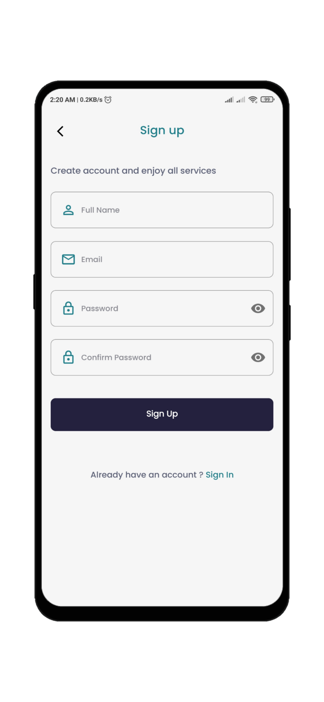

# Firebase Authentication Android Project

<div align="center">
  
  
  
  
</div>

This Android project demonstrates how to implement Firebase Authentication in your app, including sign-in, sign-up, and forgot password functionalities.

## Getting Started

1. Clone this repository to your local machine:

    ```bash
    git clone https://github.com/nirajk24/Firebase-Auth
    ```

2. Open the project in Android Studio.

3. Configure Firebase for your project:

   - Go to the Firebase Console.
   - Create a new project or use an existing one.
   - Add an Android app to your project and follow the setup instructions to obtain the `google-services.json` file.
   - Place the `google-services.json` file in the app module of your project.

4. Build and run the app on an Android emulator or physical device.

## Features

1. **Sign Up**: Users can create a new account by providing their email and password.

2. **Sign In**: Existing users can sign in to the app using their registered email and password.

3. **Forgot Password**: Users can reset their password by entering their registered email address.

## Dependencies

- Firebase Authentication: [Firebase Authentication Documentation](https://firebase.google.com/docs/auth)

## Troubleshooting

If you encounter any issues or have questions, feel free to reach me at https://www.linkedin.com/in/nirajk24/
